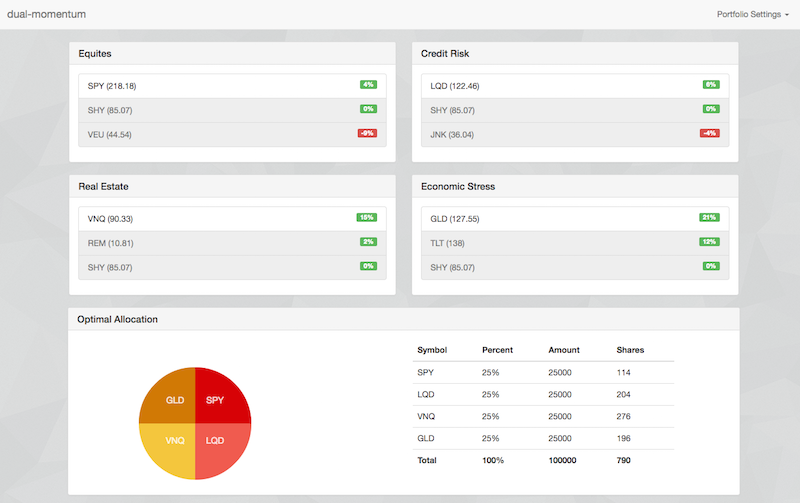

# dual-momentum



### Description

A little React/Redux app for following a dual momentum portfolio strategy

### Installation

```
git clone https://github.com/andrewjesaitis/dual-momentum.git
cd dual-momentum
npm install
npm run start
```
### CORS
In getting the values from google finance we run in cross site scripting issues
This version uses a chrome extension forceCORS https://chrome.google.com/webstore/detail/forcecors/oajaiobpeddomajelicdlnkeegnepbin (others are available - but this is simple and allows fine grained control). See docs at:
https://github.com/chrisdeely/ForceCORS

It's configured like this
http://finance.google.com/*
Access-Control-Allow-Origin http://localhost:8080
Access-Control-Allow-Credentials true

Maybe in another iteration we can put up a little server (not just webpack) to handle this.
